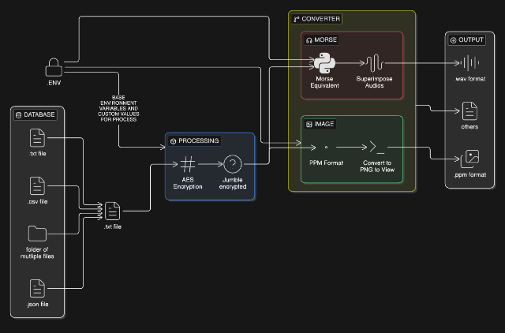

# en-crypter

An encrypted and **UNCONVENTIONAL** way to save the data on the Internet's free to upload and no-limit sites rather than paying for the storage and the services.

Encrypter is a local-first containerized *(will soon be containerized)* software that can be used to encrypt the data and store it in different formats, on platforms like SoundCloud, YT, or even Pinterest *(jus one thing, wherever you store, jus keep in mind, data is not COMPRESSED and stored- as it could lead to some errors - and for the `v1` - error correction is not yet present)*.

## EVERY MODULE AND ITS CODE
Find in the below table about the working and the code of each of the module. Make tweaks acc to your choice and read the `README.md` of each module.
| Module Name | Description | Link |
| :--- | :--- | :--- |
| `text-to-morse-video` | Convert text to morse code and encode in video | [📁 Directory](./text-to-morse-video) |
| `text-to-image` | Convert text to image with encryption | [📁 Directory](./text-to-image) |

## GETTING STARTED
### DOCKERIZED VERSION
This repo is best run as a 2-service Docker stack:
- the frontend is exposed on port 3000
- the backend stays private inside the Docker network and is not published to the host
- the frontend talks to the backend through a reverse proxy route in Next.js

This is the cleanest way to satisfy the requirement that the backend is only reachable by the frontend, not by the machine running the container.

```bash
# from the repo root
cp .env.example .env 2>/dev/null || true

docker compose up --build
```

Then open:
- http://localhost:3000

The backend is available only inside the Docker network, not on your host machine. If you want to test it directly inside the container, use:

```bash
docker compose exec backend curl http://localhost:8000/api/health
```

### CLONE AND RUN LOCALLY
In order to run this locally, simply do the following-
```bash
# for ssh based- copy this:
git clone git@github.com:Th3C0d3Mast3r/en-crypter.git

# for HTTP based- copy this:
git clone https://github.com/Th3C0d3Mast3r/en-crypter.git

# Once cloned, run the following:-
python -m venv venv
source venv/bin/activate
pip install -r requirements.txt
cd frontend && npm i

# Now, for each of the following subdirectories, copy the .env.sample to .env
cd  text-to-morse-video && cp .env.sample .env
cd text-to-image && cp .env.sample .env
# and so on . . . . 
```

> [!NOTE]
> Change the default things in the .env so that, the encrypted files are unique! 

Once this is cloned, now, to run, start the backend server and then, start the frontend service-
```bash
# From the repo base, run-
python api_server.py

# On a different terminal, run-
cd frontend
npm run dev

# the frontend is exposed to the port 3000. To change this, make changes in the code!
```


## HOW ITS WORKING
So, the current modules of `text-to-morse-video` and the `text-to-image` work on the below flow-


> [!IMPORTANT]
> The above image has sections. Currently, the `v1` has 2 modules, thus, have shown them. As I go on to add more, I won't be updating the flow - but yes, the idea is this only. And yes, to know the specifications and stuff, do visit the subdirectory of that module, and understand, what I have used there.

## CONTRIBUTING GUIDELINES
Contributions are open- lol, this is a personal project, but well, if u have something that is unique, and would fit well to the concept of this, create a PR and do propose a MR - would review the code, and if sets well- will Merge it

***JUST KEEP THIS- WHEN PROPOSING AN MR- MAKE CHANGES TO THE `api_server.py` AS WELL- BECASUE THE MODULE REACHABILITY IS PRESENT THERE. ALSO, FOR THE DOCKERIZED VERSION, ONCE NEW MR COMES, WILL WRITE A GITHUB ACTION THAT WILL INTEGRATE THAT TO CONTAINERIZED VERSION AS WELL!**

## 